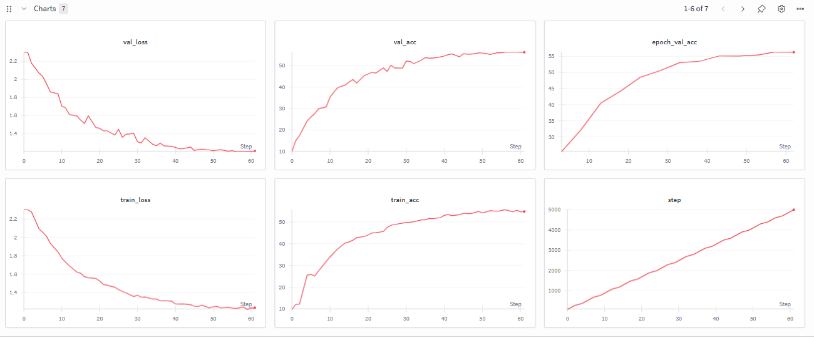

# AlexNet (2012) - ClassicCNNs

This repository contains a faithful recreation of **AlexNet (2012)**, trained on **CIFAR-10** with original configurations. All training metrics, including loss and accuracy, are fully logged in **[Weights & Biases (wandb)](https://wandb.ai/)**.



---

## Model Overview

**AlexNet** was introduced in 2012 and is composed of:

- **5 Convolutional Layers** with ReLU activations
- **3 Fully Connected Layers**
- **Max-Pooling** after selected layers
- **Local Response Normalization (LRN)** for regularization
- **Dropout** in fully connected layers

This implementation preserves **the original AlexNet weight initialization** exactly as described in the paper.

---

## Configuration

| Layer Type           | Parameters / Notes                        |
|---------------------|------------------------------------------|
| Conv1               | 96 filters, 11x11 kernel, stride 4, padding 2 |
| Conv2               | 256 filters, 5x5 kernel, padding 2       |
| Conv3               | 384 filters, 3x3 kernel, padding 1       |
| Conv4               | 384 filters, 3x3 kernel, padding 1       |
| Conv5               | 256 filters, 3x3 kernel, padding 1       |
| Fully Connected 1   | 4096 units, ReLU, Dropout 0.5            |
| Fully Connected 2   | 4096 units, ReLU, Dropout 0.5            |
| Fully Connected 3   | 10 units (for CIFAR-10)                  |
| Activation          | ReLU                                      |
| Normalization       | Local Response Normalization (LRN)       |
| Pooling             | MaxPooling 3x3, stride varies            |

**Training Details:**

- Dataset: CIFAR-10 (images resized to 224×224)  
- Optimizer: SGD with momentum 0.9, weight decay 5e-4  
- Learning Rate: 0.01 with **Cosine Annealing Scheduler**  
- Loss: Cross-Entropy  
- Epochs: 13  
- Batch Size: 128  
- Gradient Clipping: 1.0  

---

## Data Pipeline

- **Training Transformations**: Resize, RandomResizedCrop(224), RandomHorizontalFlip, ToTensor, Normalize  
- **Validation Transformations**: Resize, CenterCrop(224), ToTensor, Normalize  

Data is loaded using PyTorch `DataLoader` with **4 workers**.

---

## Training & Evaluation

- Training and validation metrics are logged in **wandb** at every 100 steps.  
- Despite training for **only 13 epochs**, the model already shows **significant accuracy improvement**.  
- Extending training to ~30 epochs is expected to improve accuracy further.  

**Example WandB metrics:**

| Metric       | Description |
|-------------|-------------|
| train_loss  | Cross-entropy loss on training batches |
| train_acc   | Accuracy on training batches |
| val_loss    | Loss on validation set |
| val_acc     | Accuracy on validation set |
| epoch_val_acc | Accuracy evaluated at the end of each epoch |


---

## Usage

```python
from alexnet import AlexNet_2012
import torch

device = "cuda" if torch.cuda.is_available() else "cpu"
model = AlexNet_2012(num_classes=10).to(device)

# Forward pass example
x = torch.randn(1, 3, 224, 224).to(device)
output = model(x)
print(output.shape)  # torch.Size([1, 10])

